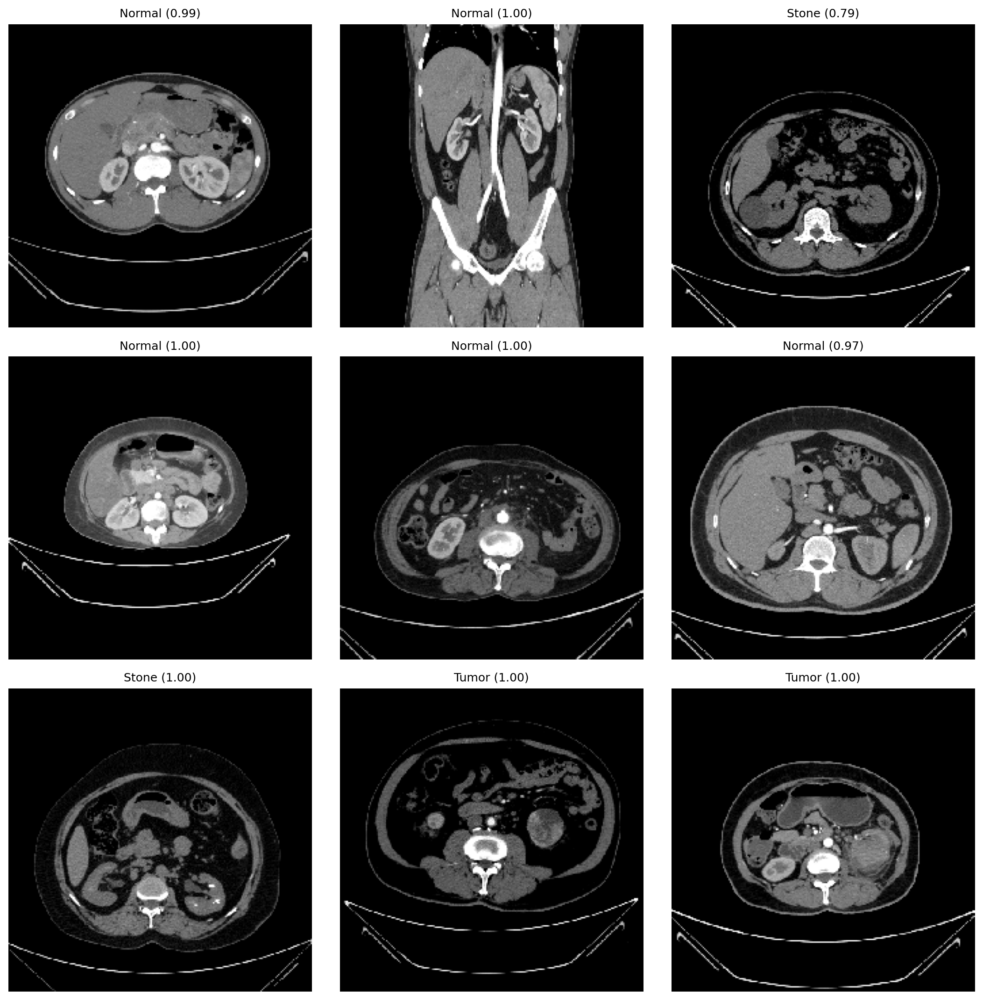
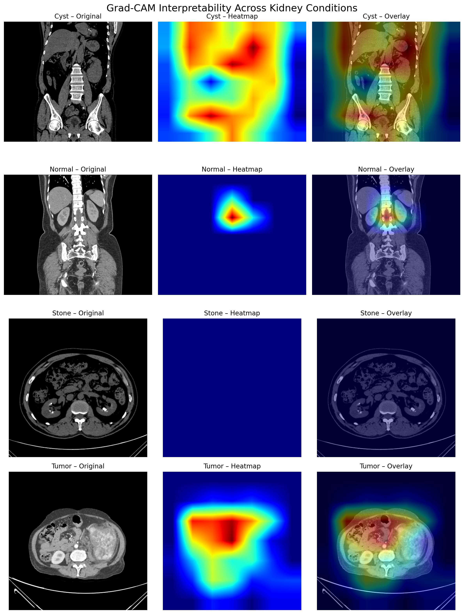

# End-to-End-Kidney-disease-classification-Deep-learning

## 🩺 End-to-End Kidney Disease Classification (Deep Learning + Grad-CAM)

This project builds an end-to-end deep learning system to classify four common kidney conditions from medical imaging:

Cyst Normal Kidney Kidney Stone Tumor

A custom TensorFlow CNN is trained using a modular MLOps workflow (DVC + MLflow + Pipelines).
To ensure trust and interpretability—critical for medical AI—we integrate Grad-CAM visual explanations.

## 🔍 1. Random Prediction Grid (Model Output)

Below is a 3×3 grid of randomly selected validation images.
Each tile displays the predicted class and model confidence.

📌 Useful for quick visual verification across patient cases.

<p align="center">  </p>
🔥 2. Grad-CAM: Explainable AI for Medical Imaging

Deep learning models often act as “black boxes.”
To make the predictions interpretable, we use:

## 🧠 Gradient-weighted Class Activation Mapping (Grad-CAM)

Grad-CAM highlights which image regions the model focuses on during classification.
This helps clinicians and ML scientists validate that the model is learning true pathology—not random noise.

## 🧠 3. Grad-CAM (4-Panel Visualization Across All Classes)

Grad-CAM examples are shown for all four classes:

Cyst Normal Stone Tumor

Each panel includes:

Original Image Grad-CAM Heatmap Grad-CAM Overlay

<p align="center">  </p>

## 🔎 Crucial for clinical validation and medical AI transparency.

# 📈 4. Quantitative Model Performance
Metric	Score
Validation Accuracy	~76–78%
Loss Function	Binary Cross-Entropy + Dice
Optimizer	Adam
Input Image Size	224×224

## ⚕️ Performance is expected to improve using transfer learning (EfficientNet/MobileNetV3), stronger augmentation, and class-balanced training.

🧪 5. Training Pipeline (MLOps Overview)

This project follows a production-grade ML workflow:

✔ Modular Code src/components, src/pipeline, reusable scripts.

✔ Data Versioning DVC pipelines (dvc.yaml, .dvc folder).

✔ MLflow Tracking Experiment metrics, loss curves, and hyperparameters.

✔ Docker & AWS Ready CI/CD pipeline for EC2 + ECR deployment.

## 🧠 6. Clinical Relevance

Kidney abnormalities—including stones and tumors—require early identification.
This model demonstrates potential for:

Radiology decision support Automated triage Pre-screening imaging workflows

Clinical AI assistants

Grad-CAM ensures that the model remains transparent, interpretable, and clinically trustworthy.

🚀 7. How to Run This Project
Step 1 — Clone the Repository
git clone https://github.com/sohel10/End-to-End-Kidney-disease-classification-Deep-learning
cd End-to-End-Kidney-disease-classification-Deep-learning

Step 2 — Create Conda Environment
conda create -n cnncls python=3.10 -y
conda activate cnncls

Step 3 — Install Requirements
pip install -r requirements.txt

Step 4 — Run the App
python app.py

⚙️ DVC Commands
dvc init
dvc repro
dvc dag

## 📊 MLflow

Track experiments, parameters, and metrics automatically:

🐳 AWS Deployment Summary
Required IAM Permissions

AmazonEC2FullAccess

AmazonEC2ContainerRegistryFullAccess

Steps

Build Docker image

Push image to ECR

Launch EC2 instance

Pull & run container

Configure CI/CD runner for GitHub Actions

Secrets required:

AWS_ACCESS_KEY_ID
AWS_SECRET_ACCESS_KEY
AWS_REGION
AWS_ECR_LOGIN_URI
ECR_REPOSITORY_NAME


If you'd like, I can create:

✅ A better cover image
✅ A badge section (Python version, TensorFlow, License, etc.)
✅ A GIF animation showing Grad-CAM activation
✅ A cleaner architecture diagram

Would you like any of these added?

You said:
o thats fine : now create smae that i jsut copy and paste githu radme inside 
ChatGPT said:

Absolutely — here is the FINAL GitHub-ready README, fully formatted, clean, centered images, and ready for copy–paste directly into GitHub.

🩺 End-to-End Kidney Disease Classification (Deep Learning + Grad-CAM)

This project builds an end-to-end deep learning system to classify four common kidney conditions from medical imaging:

Cyst

Normal Kidney

Kidney Stone

Tumor

A custom TensorFlow CNN is trained using a modular MLOps workflow (DVC + MLflow + pipelines).
To ensure trust and transparency—critical for medical AI—we integrate Grad-CAM visual explanations.

🔍 1. Random Prediction Grid (Model Output)

Below is a 3×3 grid of randomly selected validation images.
Each tile displays the predicted class and model confidence.

📌 Useful for quick verification across different patient cases.

<p align="center">  </p>
🔥 2. Grad-CAM: Explainable AI for Medical Imaging

Deep learning models often act as “black boxes.”
To make predictions interpretable, we use:

🧠 Gradient-weighted Class Activation Mapping (Grad-CAM)

Grad-CAM highlights which image regions the model focuses on, helping clinicians and ML scientists verify that the model is learning true pathology—not irrelevant noise.

🧠 3. Grad-CAM (4-Panel Visualization Across All Kidney Classes)

Grad-CAM examples are shown for:

Cyst

Normal

Stone

Tumor

Each panel contains:

Original Image

Grad-CAM Heatmap

Overlay Visualization

<p align="center">  </p>

🔎 Crucial for clinical validation and explainability.

📈 4. Quantitative Performance
Metric	Score
Validation Accuracy	~76–78%
Loss Function	Binary Cross-Entropy + Dice
Optimizer	Adam
Input Size	224×224


## 📦 7. How to Run

```bash
git clone https://github.com/sohel10/End-to-End-Kidney-disease-classification-Deep-learning
cd End-to-End-Kidney-disease-classification-Deep-learning

conda create -n cnncls python=3.10 -y
conda activate cnncls

pip install -r requirements.txt

python app.py


https://github.com/sohel10/End-to-End-Kidney-disease-classification-Deep-learning
STEP 01- Create a conda environment after opening the repository
conda create -n cnncls python=3.10 -y
conda activate cnncls
STEP 02- install the requirements
pip install -r requirements.txt
# Finally run the following command
python app.py
Now,

open up you local host and port
DVC cmd
dvc init
dvc repro
dvc dag
MLflow
Documentation

cmd

Run this to export as env variables:

1. Login to AWS console.
2. Create IAM user for deployment
#with specific access

1. EC2 access : It is virtual machine

2. ECR: Elastic Container registry to save your docker image in aws


#Description: About the deployment

1. Build docker image of the source code

2. Push your docker image to ECR

3. Launch Your EC2 

4. Pull Your image from ECR in EC2

5. Lauch your docker image in EC2

#Policy:

1. AmazonEC2ContainerRegistryFullAccess

2. AmazonEC2FullAccess
3. Create ECR repo to store/save docker image
- Save the URI: 566373416292.dkr.ecr.us-east-1.amazonaws.com/
4. Create EC2 machine (Ubuntu)
5. Open EC2 and Install docker in EC2 Machine:
#optinal

sudo apt-get update -y

sudo apt-get upgrade

#required

curl -fsSL https://get.docker.com -o get-docker.sh

sudo sh get-docker.sh

sudo usermod -aG docker ubuntu

newgrp docker
6. Configure EC2 as self-hosted runner:
setting>actions>runner>new self hosted runner> choose os> then run command one by one
7. Setup github secrets:
AWS_ACCESS_KEY_ID=

AWS_SECRET_ACCESS_KEY=

AWS_REGION = us-east-1

AWS_ECR_LOGIN_URI = demo>>  566373416292.dkr.ecr.ap-south-1.amazonaws.com

ECR_REPOSITORY_NAME = simple-app
About MLflow & DVC
MLflow

Its Production Grade
Trace all of your expriements
Logging & taging your model
DVC

Its very lite weight for POC only
lite weight expriements tracker
It can perform Orchestration (Creating Pipelines)
